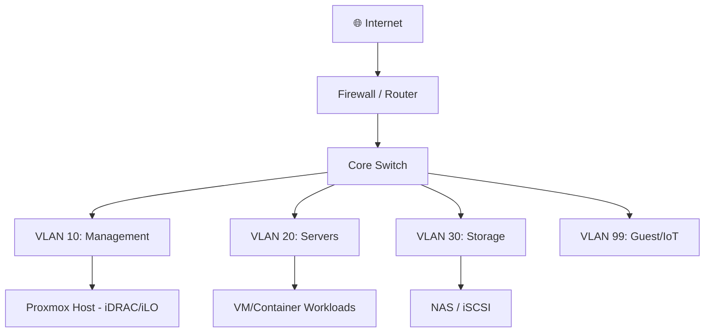

# 🗺️ Network Topology

```mermaid
graph TD
    A[🌐 Internet] --> B[Firewall / Router]
    B --> C[Core Switch]
    C --> D[VLAN 10: Management]
    C --> E[VLAN 20: Servers]
    C --> F[VLAN 30: Storage]
    C --> G[VLAN 99: Guest/IoT]
    D --> H[Proxmox Host - iDRAC/iLO]
    E --> I[VM/Container Workloads]
    F --> J[NAS / iSCSI]
```

## Notes
- Firewall enforces inter-VLAN routing policy
- Management VLAN isolated from Guest/IoT
